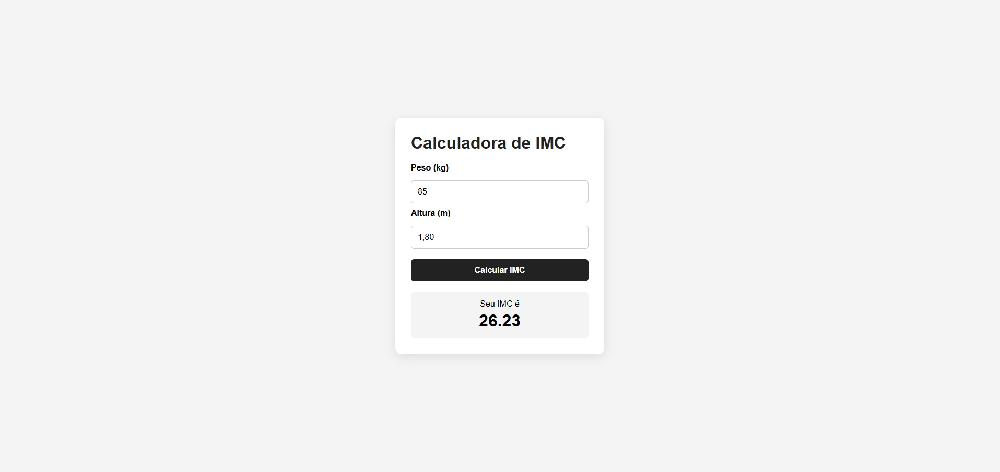

# 🧮 Calculadora de IMC com Python

Aplicação web desenvolvida com **Python e Flask** para realizar o cálculo de IMC a partir dos dados informados pelo usuário.

Este projeto foi desenvolvido com o objetivo de praticar conceitos fundamentais de desenvolvimento web utilizando Python no back-end.

## 📸 Preview



## 🚀 Tecnologias utilizadas

- Python
- Flask
- HTML5
- CSS3
- Git
- GitHub

## ⚙️ Funcionalidades

- Entrada de peso
- Entrada de altura
- Cálculo automático
- Resultado formatado com duas casas decimais
- Validação de valores inválidos
- Interface responsiva

## 📂 Estrutura do projeto

```text
calculadora-imc-python/
│
├── app.py
├── requirements.txt
├── .gitignore
├── README.md
│
├── assets/
│   └── preview.png
│
├── static/
│   └── style.css
│
└── templates/
    └── index.html